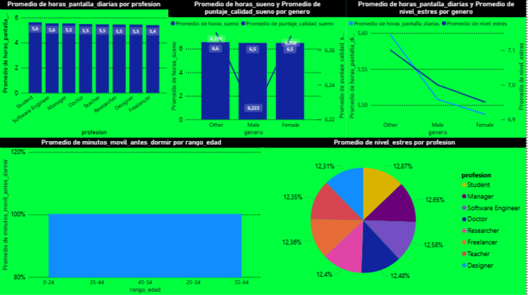

# 📊 Análisis de Baja Productividad y Energía en la Sociedad

## 🧠 Descripción del Proyecto

Este proyecto tiene como objetivo analizar los factores que están afectando la **productividad y niveles de energía en la sociedad actual**, utilizando datos relacionados con hábitos diarios y comportamiento digital.

A través del análisis de datos, se busca identificar patrones que expliquen por qué las personas presentan **bajo rendimiento, fatiga constante y menor eficiencia en sus actividades diarias**.

---

## 🎯 Objetivo

Detectar los principales factores que impactan negativamente en la productividad:

- 💤 Horas de sueño
- 📱 Uso del celular antes de dormir
- 😰 Nivel de estrés
- 💻 Horas frente a pantallas

---

## 📂 Estructura del Proyecto

📁 cursor system.md /rules │   └── data-analyst_skill.md , limpieza.md , pandas.md 
📄 Analysis.py
📄 Data_analysis.xlsx
📄 LICENSE
📄 README.md
📄 Resultado_de_Analisis.txt
📄 Visualizacion-de-cansancio.pbix
🖼️ Visualizacion.png
📄 sleep_mobile_stress_dataset_15000.csv

---

## 🛠️ Tecnologías Utilizadas

- 🐍 Python (Pandas)
- 📊 Power BI (visualización de datos)
- 🤖 Inteligencia Artificial aplicada al análisis de datos
- ⚙️ Automatización de procesos
- 💻 IDE: Cursor
- 🔧 Git & GitHub

---

## 🧪 Metodología

El análisis se realizó en varias etapas:

1. **Limpieza de datos**
   - Eliminación de valores nulos
   - Normalización de variables

2. **Transformación**
   - Creación de métricas clave (ej: productividad, energía)
   - Agrupación por rangos (sleep, screen time, etc.)

3. **Análisis exploratorio**
   - Comparación de variables
   - Identificación de patrones

4. **Visualización**
   - Dashboard interactivo en Power BI

---

## 📊 Principales Hallazgos

El análisis revela patrones claros:

- ❌ **Horas de sueño insuficientes**
- ❌ **Altos niveles de estrés**
- ❌ **Exceso de horas frente a pantallas**
- ❌ **Uso intensivo del celular antes de dormir**

### 🔍 Conclusión clave:

> Existe una relación directa entre el uso excesivo de tecnología, la falta de descanso adecuado y la disminución de la productividad.

Las personas con:

- menos horas de sueño  
- más uso del celular nocturno  
- mayor exposición a pantallas  

presentan **niveles significativamente más bajos de energía y rendimiento**.

---

## 📸 Dashboard (Power BI)

---

## 🤖 Uso de Inteligencia Artificial

Este proyecto integra el uso de **IA aplicada al análisis de datos**, permitiendo:

- Automatizar procesos de limpieza y transformación
- Optimizar el análisis exploratorio
- Aumentar la eficiencia en la toma de decisiones
- Planificando antes del Desarrollo
---

## 🎓 Formación Aplicada

Este proyecto fue desarrollado aplicando conocimientos adquiridos en el curso:

**"Desarrollo de la IA para Programadores y Analistas de Datos" - MoureDev**

---

## 🚀 Valor del Proyecto

Este análisis no solo identifica problemas actuales, sino que también permite:

- Comprender hábitos negativos de la sociedad
- Detectar oportunidades de mejora en productividad
- Aplicar soluciones basadas en datos

---

## 📌 Conclusión Final

La baja productividad no es casualidad.

Es el resultado de:

- malos hábitos de sueño  
- sobreexposición tecnológica  
- altos niveles de estrés  

Este proyecto demuestra cómo el análisis de datos puede revelar **problemas invisibles pero críticos en la vida moderna**.

---

## 👨‍💻 Autor

**Aaron isaias Medina**

---

## 📄 Licencia

Este proyecto está bajo la licencia.
